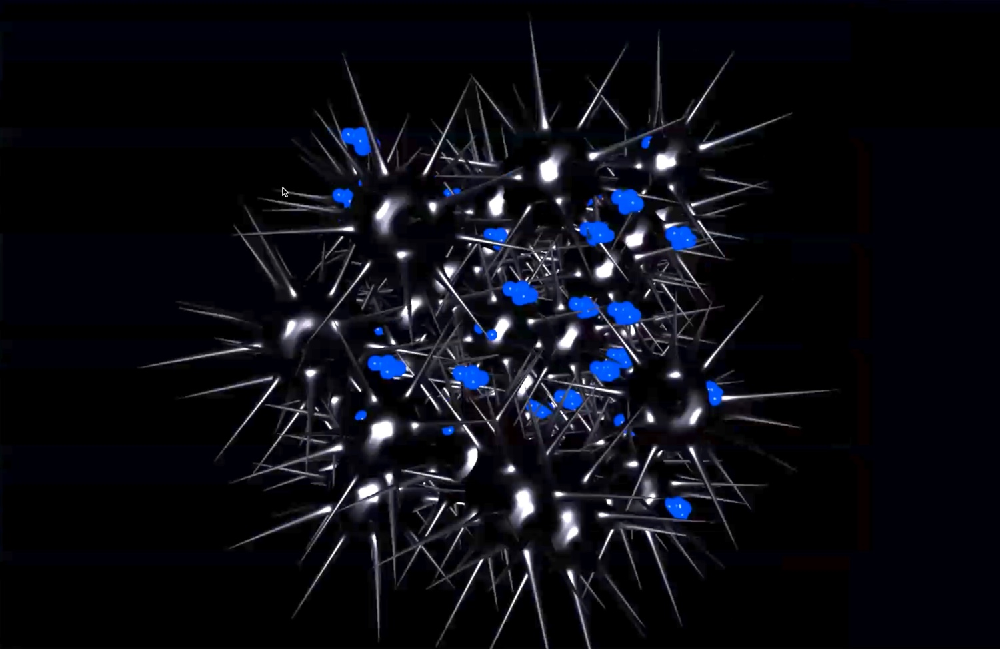

# 💭🌎 Dreamworld

Recording of the presentation (in Dutch):

https://codespacehelp.s3.amazonaws.com/zoom/2023-12-20-arthur.mp4

Tech used:

- Three.js: https://threejs.org/docs/index.html#manual/en/introduction/Creating-a-scene

- WEBMIDI.js: https://webmidijs.org/

Note that the mappings are hard-coded for the specific controller we used (AKAI MIDI MIX):

